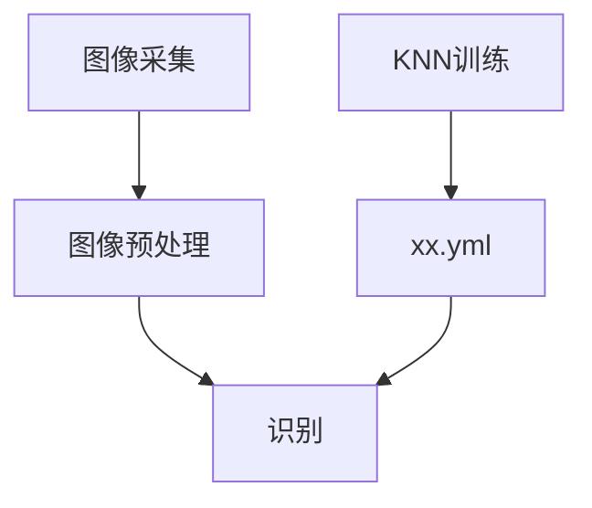

---

---

> 2025/5/2 12:33:05

vcpkg install opencv:x64-windows 安装opencv

安装后在powershell中vcpkg list | Select-String opencv查看版本

CV_RETR_EXTERNAL报错未定义，因为安装的是opencv4所以要改成cv::RETR_EXTERNAL




VS 默认工作目录是项目文件所在路径

##### knn训练

标准化：不同图片拍摄时大小不一致，不标准化，模型会误以为图像大小的不同是“有意义的特征”。resize

序列化：模型（如 KNN）要求每个输入是一个向量，reshape

数据类型转换：机器学习模型需要处理浮点特征，而不是 uchar，convertTo

##### opencv常见数据类型

| 名         | 解释       |
| ---------- | ---------- |
| cv::Mat    | 图像矩阵   |
| cv::Point  | 二维点坐标 |
| cv::Size   | 宽高       |
| cv::Rect   | 矩形       |
| cv::Scalar | bgr颜色    |
| cv::Vec    | 像素或向量 |

##### opencv常用函数

| 分类                | 函数                                                         |
| ------------------- | ------------------------------------------------------------ |
| 基础操作            | imread、imwrite、imshow、waitKey、resize、cvtColor、clone    |
| 图像处理            | threshold、GaussianBlur、medianBlur、Canny、getStructuringElement |
| 特征检测            | findContours、drawContours、contourArea、moments             |
| 几何变换与仿射      | getAffineTransform、warpAffine、getPerspectiveTransform、getPerspectiveTransform |
| 直线/圆检测         | HoughLines、HoughLinesP、HoughCircles                        |
| 图像分析 & 特征提取 | calcHist、equalizeHist、matchTemplate、compareHist           |

##### qt配置vcpkg下载的opencv

```
# —— vcpkg 安装路径 ——
VCPKG_ROOT = C:/Users/xiaoyu/vcpkg

VCPKG_LIB = $$VCPKG_ROOT/installed/x64-windows/lib

INCLUDEPATH += $$VCPKG_ROOT/installed/x64-windows/include
LIBS += $$files("$${VCPKG_LIB}/opencv_*4.lib")

# 运行时加载 DLL
win32:CONFIG(release, debug|release): PATH += $$VCPKG_ROOT/installed/x64-windows/bin
win32:CONFIG(debug, debug|release):    PATH += $$VCPKG_ROOT/installed/x64-windows/bin
```

然后在项目那里环境中，build environment中的path中添加vcpkg中的bin就是包含dll的目录

qt的默认工作目录是exe所在的目录build/xxxrelease中，可以点击项目，然后在工作目录那里设置

##### qtcreator中使用vs调试的文件时报错：常量中有换行符

将文件转为utf8无bom，或者删除这行重新手敲一遍

> 2025/5/5 21:34:22

##### opencv putext中文乱码

vcpkg install opencv4[freetype]:x64-windows

#include <opencv2/freetype.hpp>

auto ft2 = cv::freetype::createFreeType2();
ft2->loadFontData("C:/Windows/Fonts/simhei.ttf", 0);
ft2->putText(…);

##### qt连接调用手机摄像头

电脑上搜索下载iVCam，手机上搜索下载iVCam

数据线连接电脑，两边都打开软件

cap.open(1);//默认为0

##### 图像识别流程

在指定框线内提取出对应卡片：

* 读取图片，转灰度
* 中值模糊处理：去除较大噪点
* 边缘检测+闭运算：边缘检测提取物体的轮廓，先膨胀，再腐蚀用于填补边缘间的小断裂平滑轮廓
* 直线检测：HoughLinesP检测上一步处理后的图中直线
* 对直线进行过滤，过滤出约与x轴平行和垂直的直线
* 对得到的两组直线，v与h：分别提取最上，下，左，右的线
* 对四条直线延长运算得到四个焦点
* 由四个焦点得到透视变换后的图：getPerspectiveTransform计算透视变换矩阵，然后warpPerspective执行透视变换得到对应的卡片

对得到的卡片定位提取数字和花色：

* 读取图片，对图片下1/3裁掉：数字存在重复对后续提取操作存在影响，同时上方也去掉一定值，识别存在空隙等
* 转灰度，threshold二值化
* findContours查找轮廓，对轮廓进行排序：顺序为从左上角开始，一行一行。每个轮廓计算外接矩形，先按 y 中心排序，将轮廓按从上到下分行，根据行高近似将轮廓分为一行。对每一行内按 x 中心从小到大排序。
* 取排序后的第1个为数字，第2个为花色：数字为卡片最左上角

##### 对提取的数字和花色用训练好的knn预测

* 读取图片，灰度处理，二值化

* resize图片到训练时使用的图片的大小，二维图像“展平”为一个一维特征向量

* convertTo将mat转为CV_32F：OpenCV 的机器学习接口一般要求输入的特征矩阵类型是 `CV_32F`（单精度浮点）

* `Ptr<KNearest> model_pixel = Algorithm::load<KNearest>("flag_knn_pixel.yml");`

  `int r1 = model_pixel->predict(vec1);`进行预测，返回值为训练值的类别标签


